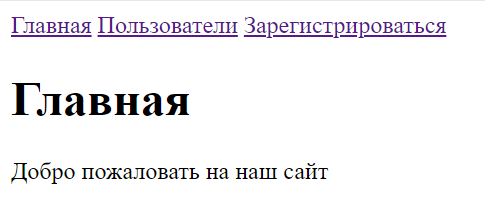
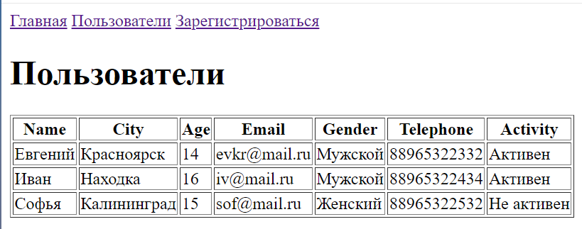
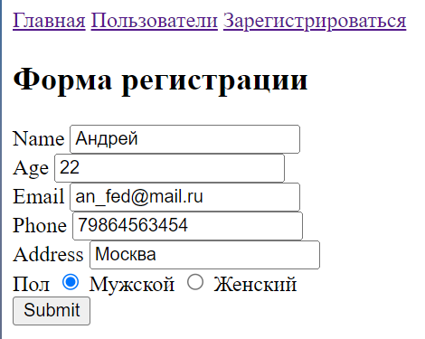
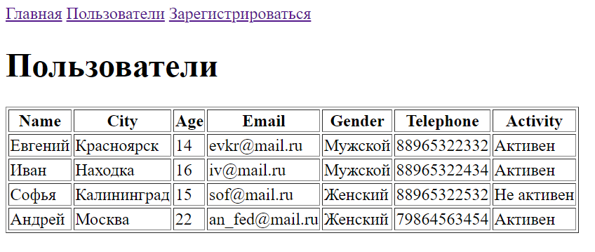

# Опорный проект
## Web-приложение "Пользователи"

Приложение представляет собой сайт с тремя страницами: "Главная", "Пользователи", "Зарегистрироваться".

 
 
 
 
 


## Используемые библиотеки:

- Flask 
- Flask-WTF
- Flask-SQLAlchemy

## Функционал сайта

- Просмотр таблицы Пользователей
- Форма регистрации нового Пользователя

## Запуск

Клонируйте репозиторий через среду разработки, либо скачайте архив проекта: зеленая кнопка "Code" -> "Download ZIP"
В случае, если необходимые библиотеки еще не установлены, выполните в Терминале:

```sh
pip install -r requirements.txt
```

Далее запустите исполняемый модуль app.py. Приложение размещается по адресу: 
```sh
http://127.0.0.1:5000/
```

## Изучение

Внутри каждого файла с кодом приведены подробные комментарии. \
Также обратите внимание на структуру папок проекта: \
Файлы html должны находится в папке "templates", файл базы данных в папке - "instance", файлы стилей и картинки - "static".


[//]: # (These are reference links used in the body of this note and get stripped out when the markdown processor does its job. There is no need to format nicely because it shouldn't be seen. Thanks SO - http://stackoverflow.com/questions/4823468/store-comments-in-markdown-syntax)

   [dill]: <https://github.com/joemccann/dillinger>
   [git-repo-url]: <https://github.com/joemccann/dillinger.git>
   [john gruber]: <http://daringfireball.net>
   [df1]: <http://daringfireball.net/projects/markdown/>
   [markdown-it]: <https://github.com/markdown-it/markdown-it>
   [Ace Editor]: <http://ace.ajax.org>
   [node.js]: <http://nodejs.org>
   [Twitter Bootstrap]: <http://twitter.github.com/bootstrap/>
   [jQuery]: <http://jquery.com>
   [@tjholowaychuk]: <http://twitter.com/tjholowaychuk>
   [express]: <http://expressjs.com>
   [AngularJS]: <http://angularjs.org>
   [Gulp]: <http://gulpjs.com>

   [PlDb]: <https://github.com/joemccann/dillinger/tree/master/plugins/dropbox/README.md>
   [PlGh]: <https://github.com/joemccann/dillinger/tree/master/plugins/github/README.md>
   [PlGd]: <https://github.com/joemccann/dillinger/tree/master/plugins/googledrive/README.md>
   [PlOd]: <https://github.com/joemccann/dillinger/tree/master/plugins/onedrive/README.md>
   [PlMe]: <https://github.com/joemccann/dillinger/tree/master/plugins/medium/README.md>
   [PlGa]: <https://github.com/RahulHP/dillinger/blob/master/plugins/googleanalytics/README.md>
